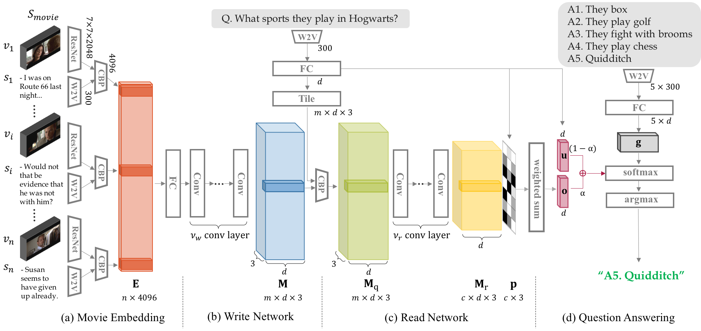

# RWMN
Paper: A Read-Write Memory Network for Movie Story Understanding, **[Seil Na](https://seilna.github.io/)**, Sangho Lee, Jisung Kim, [Gunhee Kim](http://www.cs.cmu.edu/~gunhee/). Accepted at ICCV 2017 [[arXiv]](https://arxiv.org/abs/1709.09345) 

We propose a novel memory network model named Read-Write Memory Network (RWMN) to perform question and answering tasks for large-scale, multimodal movie story understanding. The key focus of our RWMN model is to design the read network and the write network that consist of multiple convolutional layers, which enable memory read and write operations to have high capacity and flexibility. For evaluation, we apply our model to all the six tasks of the , and achieve the best accuracies on several tasks, especially on the visual QA task.

## Code will be released soon!

## Acknowledgement
We appreciate , Byeongchang Kim, Insu Jeon, , Youngjin Kim for helpful comments and discussions.

## Authors
, Sangho Lee, Jisung Kim, 

 @ Computer Science and Engineering, Seoul National University, Seoul, Korea

## License
MIT license
